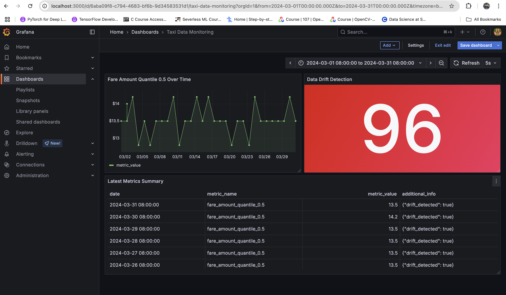
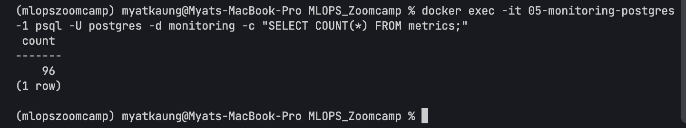

# Taxi Data Monitoring System

This project implements a monitoring system for ML batch services, specifically for taxi data. It calculates data quality metrics, stores them in a PostgreSQL database, and visualizes them using Grafana.

## Project Structure

```
05-Monitoring/
├── data/                      # Data directory
│   └── green_tripdata_2024-03.parquet  # Taxi data for March 2024
├── dashboards/                # Grafana dashboard configurations
│   ├── dashboard.yml          # Dashboard provisioning config
│   └── taxi-monitoring.json   # Taxi metrics dashboard definition
├── datasources/               # Grafana datasource configurations
│   └── postgres.yml           # PostgreSQL datasource config
├── docker-compose.yml         # Docker Compose configuration
├── init.sql                   # PostgreSQL initialization script
├── monitoring.py              # Main monitoring script
├── prepare_data.py            # Data preparation script
└── README.md                  # This file
```

## Setup and Usage

### Prerequisites

- Docker and Docker Compose
- Python 3.8+
- Required Python packages: `pandas`, `evidently`, `psycopg2`, `pyarrow`

### Installation

1. Install required Python packages:

```bash
pip install pandas evidently psycopg2-binary pyarrow
```

2. Start the monitoring infrastructure:

```bash
docker-compose up -d
```

This will start PostgreSQL and Grafana containers.

3. Run the monitoring script:

```bash
python monitoring.py
```

### Accessing Grafana

1. Open your browser and navigate to `http://localhost:3000`
2. Login with username `admin` and password `admin`
3. Navigate to the "Taxi Data Monitoring" dashboard

## Metrics

The monitoring system tracks the following metrics:

1. **Fare Amount Quantile (0.5)** - The median fare amount for each day
2. **Column Drift** - Detects statistical drift in the fare_amount column

## Dashboard

The Grafana dashboard includes:

- A time series chart showing the median fare amount over time
- A stat panel showing the number of days with detected drift
- A table showing the latest metrics

## Screenshots

### Grafana Dashboard


### PostgreSQL Database


## Q3 and Q4 Answers

### Q3: Maximum Quantile Value

The maximum value of metric quantile = 0.5 on the "fare_amount" column during March 2024 is **14.20**.

### Q4: Dashboard Configuration Location

The correct location for dashboard configuration files is:

**project_folder/dashboards** (05-monitoring/dashboards)